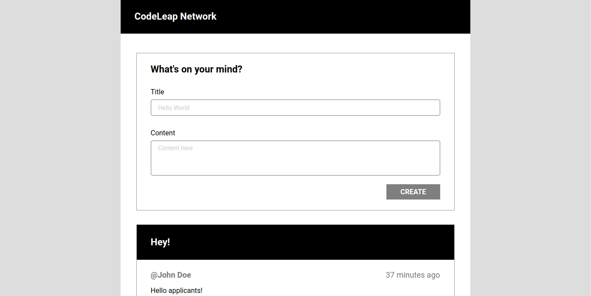

<h1 align="center">
  CodeLeap Network
</h1>

<p align="center">
  
</p>

<p align="center">
  <a href="https://code-leap-network.vercel.app/">Acessar site</a>
</p>

## Sobre o Projeto

Aplicação feita em ReactJS + Next de CRUD de postagens consumindo API da CodeLeap.

Feito para teste tecnico de vaga Junior Frontend Engineer - CodeCamp program.

## Funcionalidades

- [x] Layout responsivo.

- [x] Login armazenando usuário no Session Storage.

- [x] Listagem, criação, edição e remoção de post.

## Possiveis próximas features

- [x] Paginação de posts.

- [x] Rotas privadas para usuários logados.

- [x] Logout do usuário.

## Feito com:
- [ReactJS](https://github.com/facebook/react) - Biblioteca Javascript para construção de interfaces.
- [Next.js](https://github.com/vercel/next.js) - Framework React JS.
- [Styled Components](https://styled-components.com/) - Biblioteca de estilização.
- [Typescript](https://github.com/microsoft/TypeScript) - Supertset para Javascript.
- [React-modal](https://github.com/reactjs/react-modal) - Biblioteca para construção de modal.
- [Redux](https://redux.js.org/) - Biblioteca de gerenciamento de estado.

## Como executar

```
$ git clone https://github.com/Garcez17/CodeLeap-Network
$ cd CodeLeap-Network
$ yarn
$ yarn dev
```

## Licença

Esse projeto está sob a licença MIT. Veja o arquivo [LICENSE](https://github.com/Garcez17/CodeLeap-Network/blob/main/LICENSE) para mais detalhes.